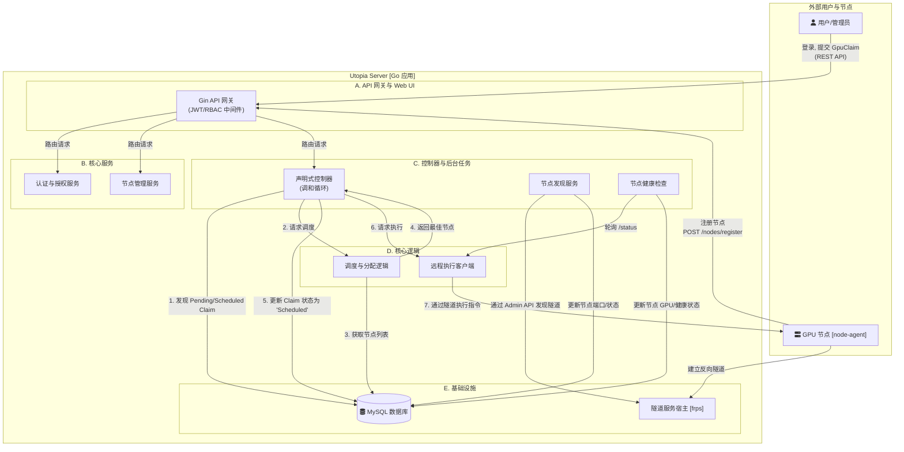

# Utopia Server - 架构与工作原理解析

本文档旨在深入剖析 `utopia-server` 的核心架构设计与关键工作流，为开发者和维护者提供一份清晰的内部指南。

## 1. 核心设计哲学：声明式系统

`utopia-server` 的根基是**声明式（Declarative）**设计，而非命令式（Imperative）。

*   **命令式**: 用户告诉系统“做什么”（例如，`POST /start-container`）。系统被动执行指令，但不关心最终结果。
*   **声明式**: 用户告诉系统“我想要什么”（例如，`POST /gpu-claims` 创建一个期望状态）。系统则主动、持续地工作，确保现实世界（Actual State）与用户的期望（Desired State）保持一致。

这种模式的核心优势在于其**健壮性和自愈能力**。如果一个容器意外崩溃，声明式系统会自动检测到“现实”与“期望”不符，并尝试重新创建容器，而无需人工干预。

## 2. 架构图

## 3. 关键工作流解析

### 工作流 1: 新节点自动上线 (Zero-Touch Onboarding)

1.  **注册**: 新 `node-agent` 启动，发现本地无 ID，于是调用 `utopia-server` 的 `POST /nodes/register` 接口。
2.  **分配身份**: `NodeService` 为其生成一个唯一的 UUID (`node-id`)，存入数据库，并将该 ID 返回给 `agent`。
3.  **建立隧道**: `agent` 保存 ID，用它动态生成 `frpc` 配置文件（例如，隧道名称为 `[node-id]_control`），并启动 `frpc` 子进程连接到服务器的 `frps` 服务。
4.  **服务发现**: `utopia-server` 的 `Discovery` 服务定期轮询 `frps` 的管理 API。它通过隧道名称识别出新节点，并解析出 `frps` 为其分配的公网端口 (`ControlPort`)。
5.  **上线**: `Discovery` 服务将节点的 `status` 更新为 `Online`，并将 `ControlPort` 存入数据库。至此，该节点正式加入资源池，可被调度。

### 工作流 2: GPU 资源声明与调和 (Reconciliation Loop)

1.  **声明期望**: 用户通过 UI 或 API 发送 `POST /api/gpu-claims` 请求，描述他们想要的容器镜像和 GPU 数量。
2.  **接受请求**: API 层通过认证和 RBAC 检查后，在数据库中创建一条 `GpuClaim` 记录，其 `status.phase` 初始为 `Pending`。
3.  **感知变化 (Perceive)**: `Controller` 的调和循环定期扫描数据库，发现了这条 `Pending` 的 `GpuClaim`。
4.  **决策 (Decide)**:
    *   控制器调用 `Scheduler`。
    *   `Scheduler` 从数据库获取所有 `Online` 状态的节点及其最新的 GPU 状态（由 `HealthChecker` 维护）。
    *   根据调度算法（例如，首次适应），选择一个最合适的节点。
    *   如果找不到合适的节点，本次调和结束，等待下一个周期重试。
5.  **行动 (Act)**:
    *   如果找到了节点，控制器将 `GpuClaim` 的 `status.phase` 更新为 `Scheduled`，并将 `status.nodeName` 设置为所选节点的 ID。
    *   在下一个调和周期，控制器发现这条 `Scheduled` 的 `Claim`。
    *   它调用 `AgentClient`，通过节点的 `ControlPort` 向 `node-agent` 的 `POST /api/v1/containers` 接口发送指令。
6.  **更新状态 (Update)**:
    *   `node-agent` 创建容器成功后，返回 `container_id`。
    *   `AgentClient` 将 `container_id` 返回给控制器。
    *   控制器最后一次更新 `GpuClaim`，将 `status.phase` 设置为 `Running`，并填入 `container_id`。
    *   如果 `node-agent` 执行失败，`phase` 则被设置为 `Failed`，并记录失败原因。

这个“感知-决策-行动-更新”的循环，就是 `utopia-server` 作为声明式系统自动化所有任务的核心工作原理。